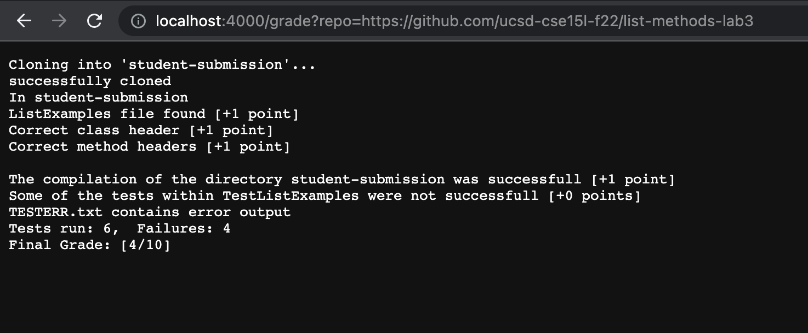
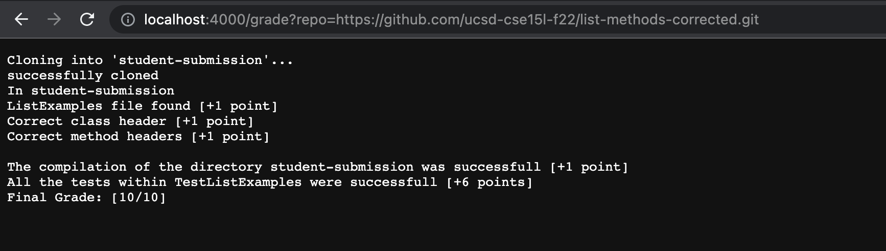
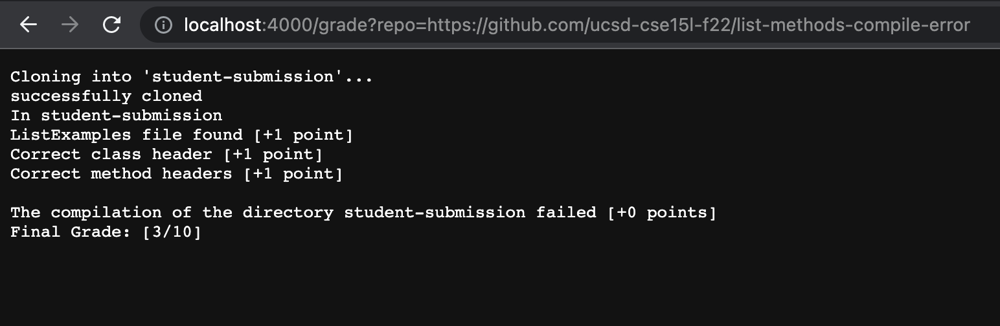

# **Lab 5 GradeScript**
## Grade.sh
```
# Create your grading script here

set -e 

COMPILEINFO=""
CPATH=".:hamcrest-core-1.3.jar:junit-4.13.2.jar"
GRADE=0

CP=".:hamcrest-core-1.3.jar:junit-4.13.2.jar"
rm -rf student-submission
git clone $1 student-submission 
echo "successfully cloned" 

rm -r testListDir
mkdir testListDir
cp lib/hamcrest-core-1.3.jar testListDir
cp lib/junit-4.13.2.jar testListDir
cp TestListExamples.java testListDir/

cd student-submission
echo "In student-submission"
if [[ -e ListExamples.java ]]
then
    echo "ListExamples file found [+1 point]"
    ((SCORE++))

    cp ListExamples.java ../testListDir
    cd ../testListDir

    GREP_CLASS_HEADER=`grep -wc "class ListExamples {" ListExamples.java`
    if [[ $GREP_CLASS_HEADER == 1 ]]
    then
        echo "Correct class header [+1 point]"
        ((SCORE++))

        GREP_FILTER=`grep -wc 'static List<String> filter(List<String> list, StringChecker sc)' ListExamples.java`
        GREP_MERGE=`grep -wc 'static List<String> merge(List<String> list1, List<String> list2)' ListExamples.java`
        if [[ $GREP_FILTER == 1 && $GREP_MERGE == 1 ]]
        then
            set +e
            echo "Correct method headers [+1 point]"
            ((SCORE++))

            javac -cp $CP ListExamples.java TestListExamples.java 2> COMPILEERR.txt
            if [ $? -eq 0 ]
            then
            echo "The compilation of the directory student-submission was successfull [+1 point]"
            ((SCORE++))

                java -cp $CP org.junit.runner.JUnitCore TestListExamples 2> TESTERR.txt > TEST.txt
                if [ $? -eq 0 ]
                then
                    echo "All the tests within TestListExamples were successfull [+6 points]"
                    ((SCORE=SCORE+6))
                    echo "Final Grade: [$SCORE/10]"
                    exit
                else 
                    echo "Some of the tests within TestListExamples were not successfull [+0 points]"
                    echo "TEST.txt contains error output of JUnit tests"
                    grep -h "Failures" TEST.txt
                    echo "Final Grade: [$SCORE/10]"
                    exit
                fi
            else 
                echo "The compilation of the directory student-submission failed [+0 points]"
                echo "COMPILEERR.txt contains error output"
                echo "Final Grade: [$SCORE/10]"
                exit
            fi
           
        else
            echo "Incorrect method headers [+0 point]"
            echo "Final Grade: [$SCORE/10]"
            exit
        fi
    else
        echo "Incorrect class header [+0 point]"
        echo "Final Grade: [$SCORE/10]"
        exit
    fi
    
else
    echo "Incorrect file: ListExamples.java file not found [+0 points]"
    echo "Final Grade: [$SCORE/10]"
    exit
fi
```

## **Student Submissions**

[list-methods-lab3](https://github.com/ucsd-cse15l-f22/list-methods-lab3)


*Final Grade: 4/10*

[list-methods-corrected](https://github.com/ucsd-cse15l-f22/list-methods-corrected)


*Final Grade: 10/10*

[list-methods-compile-error](https://github.com/ucsd-cse15l-f22/list-methods-compile-error)


*Final Grade: 3/10*

## Tracing Submission 1: list-methods-lab3

`set -e`: No stderr or stdout, stops terminal if an error is found and throws the error

Variable declarations
```
COMPILEINFO=""
CPATH=".:hamcrest-core-1.3.jar:junit-4.13.2.jar"
GRADE=0
CP=".:hamcrest-core-1.3.jar:junit-4.13.2.jar"
```
`rm -rf student-submission`: No stderr or stdout, recursively force remove student-submission directory
`git clone $1 student-submission`: No stdout; stderr: *Cloning into 'student-submission'...*; clone repository in argv 1 into directory student-submission

`echo "successfully cloned"`: stdout: *successfully cloned*; No stderr; print successfully cloned to the terminal

`rm -r testListDir`: No stderr or stdout, recursively remove testListDir directory

`mkdir testListDir`: No stderr or stdout, make testListDir directory

`cp lib/hamcrest-core-1.3.jar testListDir`: No stderr or stdout, copy .jar file into testListDir

`cp lib/junit-4.13.2.jar testListDir`: No stderr or stdout, copy .jar file into testListDir

`cp TestListExamples.java testListDir/`: No stderr or stdout, copy .java file into testListDir

`cd student-submission`: No stderr or stdout, go down path into student-submission directory

`echo "In student-submission"`: stdout: *In student-submission*, No stderr; print In Student Submission to terminal 

`if [[ -e ListExamples.java ]]`: No stderr or stdout; ListExamples.java file found, go into if block, 

`then`

`echo "ListExamples file found [+1 point]"`: stdout: *ListExamples file found*, No stderr; print In Student Submission to terminal 

`((SCORE++))`: No stderr or stdout, incremenet SCORE variable by 1

`cp ListExamples.java ../testListDir` No stderr or stdout, copy .java file into testListDir

`cd ../testListDir`: No stderr or stdout, go up path into testListDir directory

`GREP_CLASS_HEADER=grep -wc "class ListExamples {" ListExamples.java`: No stderr or stdout; get the wc of *class ListExamples {* in ListExamples.java file and store in variable GREP_CLASS_HEADER; for this run, GREP_CLASS_HEADER=1

`if [[ $GREP_CLASS_HEADER == 1 ]]`: No stderr or stdout; GREP_CLASS_HEADER=1, go into if block

`then`

`echo "Correct class header [+1 point]"`: stdout: *Correct class header*, No stderr; print Correct class header to terminal 

`((SCORE++))`: No stderr or stdout, incremenet SCORE variable by 1

`GREP_FILTER=grep -wc static List<String> filter(List<String> list, StringChecker sc) ListExamples.java`: : No stderr or stdout; get the wc of *static List<String> filter(List<String> list, StringChecker sc)* in ListExamples.java file and store in variable GREP_FILTER; for this run, GREP_FILTER=1

`GREP_MERGE=grep -wc static List<String> merge(List<String> list1, List<String> list2) ListExamples.java`: No stderr or stdout; get the wc of *static List<String> merge(List<String> list1, List<String> list2)* in ListExamples.java file and store in variable GREP_MERGE for this run, GREP_MERGE=1

`if [[ $GREP_FILTER == 1 && $GREP_MERGE == 1 ]]`: No stderr or stdout; GREP_FILTER=1 and GREP_MERGE=1, go into if block

`then`
            
`set +e`: No stderr or stdout, ignores error if found, continue executing terminal
    
`echo "Correct method headers [+1 point]"`: stdout: *Correct method headers*, No stderr; print Correct method headers to terminal 
            
`((SCORE++))`: No stderr or stdout, incremenet SCORE variable by 1
            
`javac -cp $CP ListExamples.java TestListExamples.java 2> COMPILEERR.txt`: No stderr or stdout; compile .jar, TestListExamples.java
 
`if [ $? -eq 0 ]`: No stderr or stdout; last executed statement=0, go into if block
 
`then`
 
`echo "The compilation of the directory student-submission was successfull [+1 point]"`: stdout: *The compilation of the directory student-submission was successful [+1 point]*, No stderr; print The compilation of the directory student-submission was successful [+1 point] to terminal 
 
`((SCORE++))`: No stderr or stdout, incremenet SCORE variable by 1
 
`java -cp $CP org.junit.runner.JUnitCore TestListExamples 2> TESTERR.txt > TEST.txt`: 

stdout: 
```
JUnit version 4.13.2
.E..E..E.E
Time: 0.363
There were 4 failures:
1) testMergeDuplicates(TestListExamples)
org.junit.runners.model.TestTimedOutException: test timed out after 100 milliseconds
	at ListExamples.merge(ListExamples.java:43)
	at TestListExamples.testMergeDuplicates(TestListExamples.java:43)
2) testMergeAlternate(TestListExamples)
org.junit.runners.model.TestTimedOutException: test timed out after 100 milliseconds
	at ListExamples.merge(ListExamples.java:43)
	at TestListExamples.testMergeAlternate(TestListExamples.java:102)
3) testMergeOne(TestListExamples)
org.junit.runners.model.TestTimedOutException: test timed out after 100 milliseconds
	at java.base/java.util.Arrays.copyOf(Arrays.java:3512)
	at java.base/java.util.Arrays.copyOf(Arrays.java:3481)
	at java.base/java.util.ArrayList.grow(ArrayList.java:237)
	at java.base/java.util.ArrayList.grow(ArrayList.java:244)
	at java.base/java.util.ArrayList.add(ArrayList.java:454)
	at java.base/java.util.ArrayList.add(ArrayList.java:467)
	at ListExamples.merge(ListExamples.java:42)
	at TestListExamples.testMergeOne(TestListExamples.java:86)
4) testFilter(TestListExamples)
java.lang.AssertionError: expected:<[mistery, words]> but was:<[words, mistery]>
	at org.junit.Assert.fail(Assert.java:89)
	at org.junit.Assert.failNotEquals(Assert.java:835)
	at org.junit.Assert.assertEquals(Assert.java:120)
	at org.junit.Assert.assertEquals(Assert.java:146)
	at TestListExamples.testFilter(TestListExamples.java:27)

FAILURES!!!
Tests run: 6,  Failures: 4

```
No stderr; run .jar .JUnitCore file, TestListExamples`
 
`if [ $? -eq 0 ]`: No stderr or stdout; $? equals 1, go to else block 

Does not execute
```
then
 
echo "All the tests within TestListExamples were successfull [+6 points]"
 
((SCORE=SCORE+6)) 
echo "Final Grade: [$SCORE/10]"
exit
```
 
`else` 
 
`echo "Some of the tests within TestListExamples were not successfull [+0 points]"`: stdout: *Some of the tests within TestListExamples were not successfull [+0 points]*, No stderr; print Some of the tests within TestListExamples were not successfull [+0 points] to terminal 
 
`echo "TEST.txt contains error output of JUnit tests"`: stdout: *TEST.txt contains error output of JUnit tests*, No stderr; print TEST.txt contains error output of JUnit tests to terminal 
  
`grep -h "Failures" TESTERR.txt`: stdout: Tests run: 6,  Failures: 4, No stderr; return line with "Failures" in TESTERR.txt
 
`echo "Final Grade: [$SCORE/10]"`: stdout: *Final Grade: [$SCORE/10], No stderr; print Final Grade: [$SCORE/10] to terminal

`exit`

`fi`

Does not run
```
            else
                echo "The compilation of the directory student-submission failed [+0 points]"
                echo "COMPILEERR.txt contains error output"
                echo "Final Grade: [$SCORE/10]"
                exit
            fi
        else
            echo "Incorrect method headers [+0 point]"
            echo "Final Grade: [$SCORE/10]"
            exit
        fi
    else
        echo "Incorrect class header [+0 point]"
        echo "Final Grade: [$SCORE/10]"
        exit
    fi   
else
    echo "Incorrect file: ListExamples.java file not found [+0 points]"
    echo "Final Grade: [$SCORE/10]"
    exit
```

`fi`