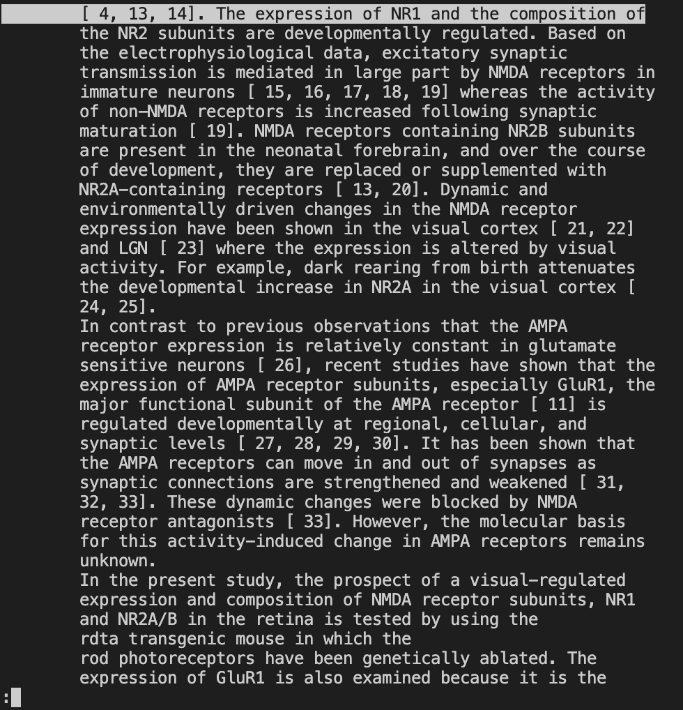

# Researching Comands
## **less -p**

**-p:** find matching patterns. This is useful when looking for a specific word or phrase in a file or to skim data.

`less -pNMDA 1471-2202-2-7.txt`: finds all patterns containing NMDA in the file, use *n* to go to the next pattern and *N* to go to the previous pattern.

>

`less -pDNA *.txt`: finds all patterns containing DNA in all the text files in the directory biomed using *:n* to go to the next file.

>

`less -Np results 1471-2202-2-7.txt`: finds all patterns containing results in this specific file with line numbers.
>

## **less --incsearch**

**--incsearch:** search as each key character is typed in file. This is useful when trying to do a search for many different words quickly in a file or to see what words are similar. It is similar to *ctrl + f*.

`less --incsearch 1471-2202-2-7.txt` with /a: find all words that have the letter *a*. [Enter] to move to the next word

>

`less --incsearch 1471-2202-2-7.txt` with /anti: find all words that have *anti*. [Enter] to move to the next word

>

`less --incsearch 1471-2202-2-7.txt` with /antibody: find all words that have *antibody*. In this case, there is one.

>

## **less -w**
**-w:** highlight the first line of a new page. This is useful when reading long text files to keep track of your position and the new line on the file. [Space] to move to next page and [b] to move to a previous page

`less -w 1471-2202-2-7.txt` no space: beginning of file, no line is highlighted.

>

`less -w 1471-2202-2-7.txt` hit space once: first line of first page is highlighted.

>

`less -w 1471-2202-2-7.txt` hit space again (total = 2 times): first line of second page is highlighted.

>
