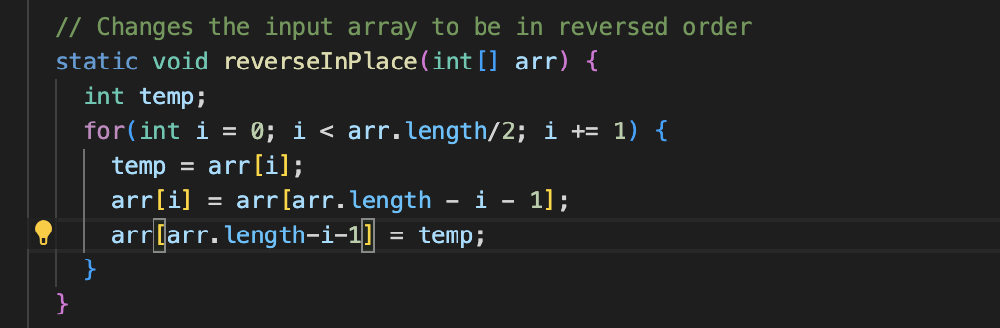
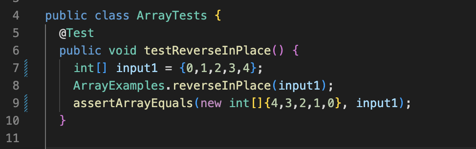
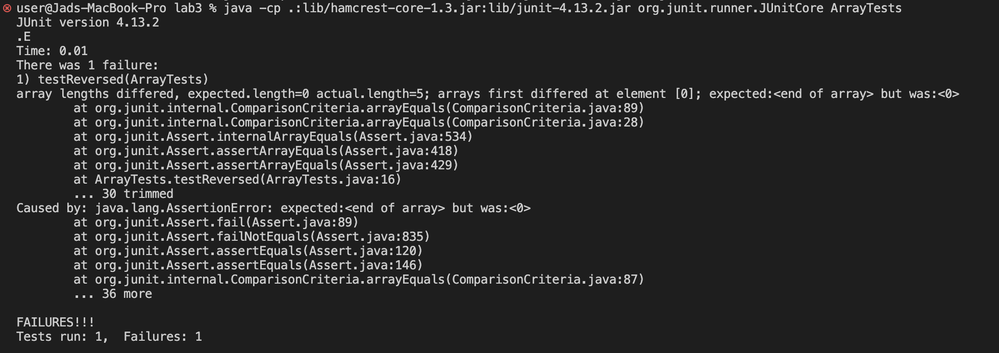
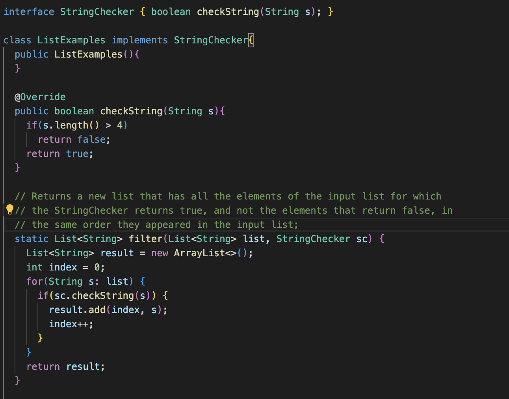
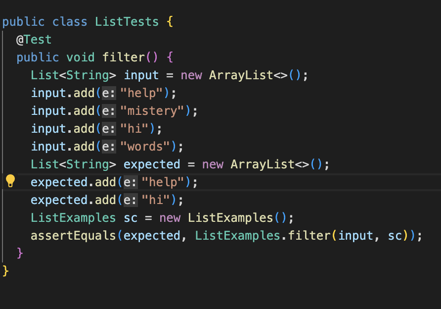
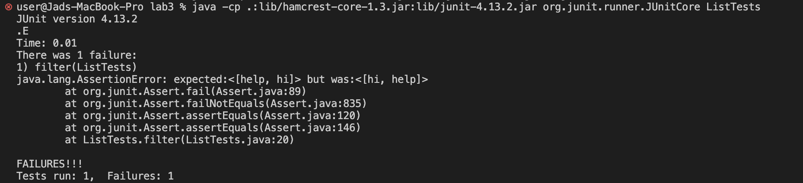

# Simple Search Engine and Bugs!

## Simple Search Engine :mag_right:
Here's what the insides of a simple search engine looks like:

```
import java.io.IOException;
import java.net.URI;
import java.util.ArrayList;

class Handler implements URLHandler {
    // The one bit of state on the server: a number that will be manipulated by
    // various requests.
    ArrayList<String> words = new ArrayList<String>();
    public String handleRequest(URI url) {
        String[] parameters;
        if (url.getPath().contains("/add")) {
            parameters = url.getQuery().split("=");
            if (parameters[0].equals("s")) {
                words.add(parameters[1]);
                return String.format("Word added: %s", parameters[1]);
            }
        } else {
            if (url.getPath().contains("/search")) {
                parameters = url.getQuery().split("=");
                if (parameters[0].equals("s")) {
                    String matches = "";
                    for (String i : words) {
                        if (i.contains(parameters[1]))
                            matches += i;
                        matches += " ";
                    }
                    return String.format("Matches: %s", matches);
                }
            }
        }
        return "404 Not Found!";
    }
}

class SearchEngine {
    public static void main(String[] args) throws IOException {
        if (args.length == 0) {
            System.out.println("Missing port number! Try any number between 1024 to 49151");
            return;
        }

        int port = Integer.parseInt(args[0]);

        Server.start(port, new Handler());
    }
}
```

Heres a Number Server:
```
import java.io.IOException;
import java.net.URI;

class Handler implements URLHandler {
    // The one bit of state on the server: a number that will be manipulated by
    // various requests.
    int num = 0;

    public String handleRequest(URI url) {
        if (url.getPath().equals("/")) {
            return String.format("Number: %d", num);
        } else if (url.getPath().equals("/increment")) {
            num += 1;
            return String.format("Number incremented!");
        } else {
            System.out.println("Path: " + url.getPath());
            if (url.getPath().contains("/add")) {
                String[] parameters = url.getQuery().split("=");
                if (parameters[0].equals("count")) {
                    num += Integer.parseInt(parameters[1]);
                    return String.format("Number increased by %s! It's now %d", parameters[1], num);
                }
            }
            return "404 Not Found!";
        }
    }
}

class NumberServer {
    public static void main(String[] args) throws IOException {
        if(args.length == 0){
            System.out.println("Missing port number! Try any number between 1024 to 49151");
            return;
        }

        int port = Integer.parseInt(args[0]);

        Server.start(port, new Handler());
    }
}
```

 
* **localhost:3000/add?s=.....**: add a new string to a list (string is in the query marked by `?s=`
* **localhost:3000/search?s=.....**: query a list of strings and return the strings that have the substring in `?s=`

* The method `handleRequest(URI url)` gets called when the localhost:#### is started. It returns a result based on the path.
* The values of the strings added is stored outside of the if statements and then compared when the search query is passed.

---

## Fixing bugs :bug:, oh they're so *pesky* :wink:
For `reverseInPlace(), {0, 1, 2, 3, 4}`, the symptom is that the array is assigning the new value at index i, to the same array. In turn, the array is using the new values to replace the old values so when it reaches index 3, the array is actually {4,3,2,3,4}, thus the test fails. The bug is that a new array of the length of the input array should be declared before the loop. This new array should store the values of the input array reversed during each iteration.

Correct code:

>Create a temp variable to store value at i. Set value at i to arr.length-i-1. Set arr.length-i-1 to temp. Do this until you reach the middle of the array.





For `filter(), {“help”, “mistery”, “hi”, “words”}`, and checkString to return true if the length of the string is less than 4, the symptom is that the returned list is not in the order that they appeared. The bug is that the index was set to 0, rather than an iterative index.

Correct Code:

>Create an index that iterates everytime a string is added to the result list.




