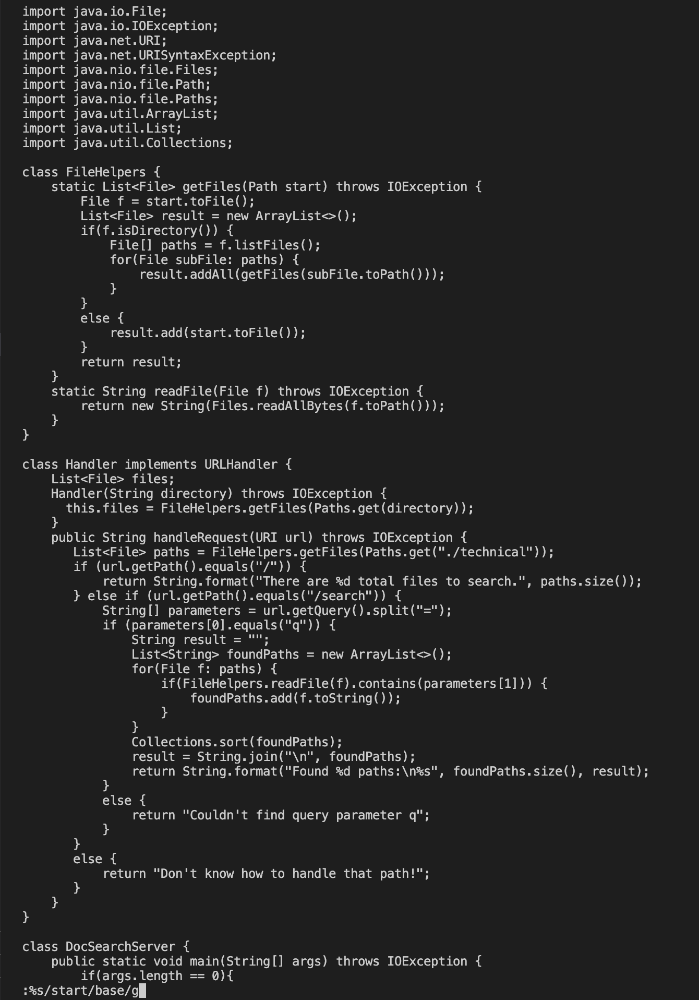
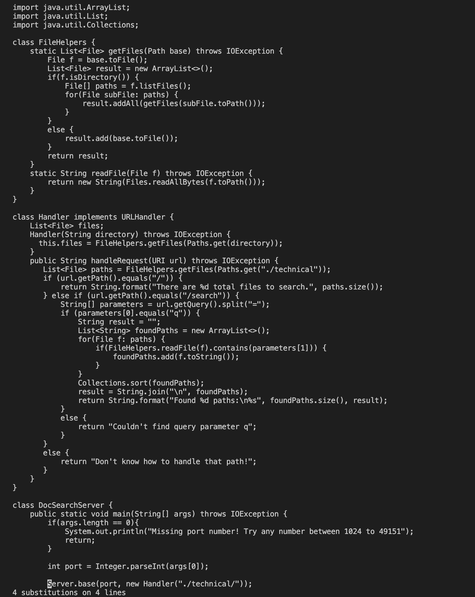
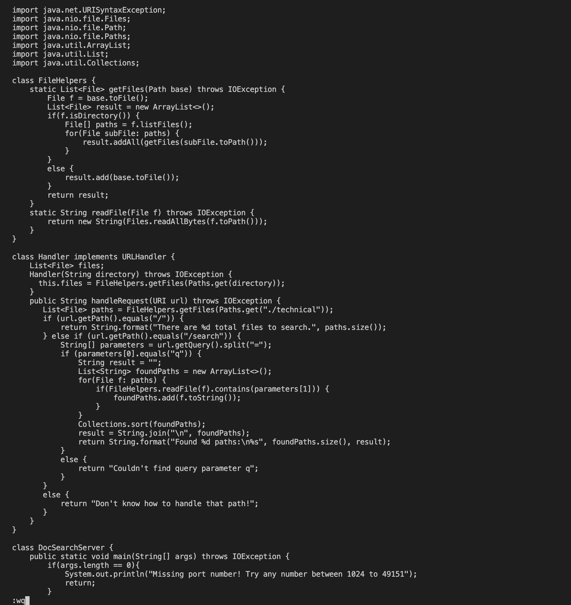
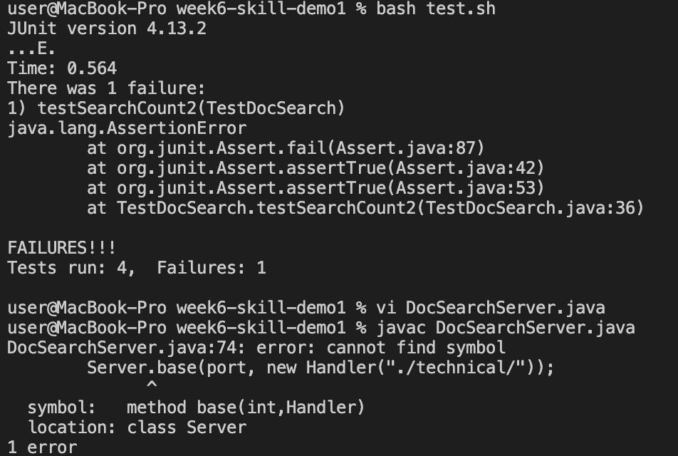
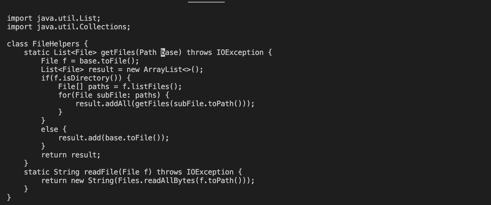

# Week 7 Lab 1
## Part 1
> In DocSearchServer.java, change the name of the start parameter of getFiles, and all of its uses, to instead be called base.

In vim: `:%s/start/base/g<ENTER>>:wq<ENTER>`
1. `:%s/start/base/g<ENTER>`: Substitutes all occurences of *base* with *start*.
**Command Breakdown**:

%s: substitue a word with another word in all lines

/start: word to substitute in

/base: word to be substituted

/g: replaces all matched words in the line to be replaced

>**Command**
>**Output**
2. `:wq<ENTER>`: Write and quit
>**Command**

**However**, there is an error when `DocSearchJava.server` is compiled according to this task. If all occurences of start switch to base, then the `Server.start` command switches to `Server.base` and the Server won't start. Thus, the tests fail.
>**Output**

## Fixed Task 1:

In vim: `:%s/start/base/g<Enter>/base<Enter>Ncestart<Esc>:wq`

> Steps 1 and 2 are the same, however we need to change `Server.base` back to `Server.start`

3. `/base<ENTER>Ncestart<ESC>:wq`: Find base, go forward to last occurence, delete word, type tart, write and quit

**Command Breakdown:**

/base: find all occurences of base in the file in Normal mode

N: Go to the previous occurence of base 

ce: replace to the end of word (deletes base), enter insert mode

start: type *start* in insert mode

wq: write and quit

>**/base**

>**N**

>**ce**

>**start**

## Part 2:

* Once, start in Visual Studio Code and make the edit there, then scp the file to the remote server and run it there to confirm it works (you can just run bash test.sh on the remote to test it out). Consider having the appropriate scp command in your command history or easily copy-pasteable!

**Time:** 30 secs

* Second, start already logged into a ssh session. Then, make the edit for the task you chose in Vim, then exit Vim and run bash test.sh.

**Time:** 45 secs

* Which of these two styles would you prefer using if you had to work on a program that you were running remotely, and why?
> I would prefer to make the edits locally, and then scp to the remote.

* What about the project or task might factor into your decision one way or another? (If nothing would affect your decision, say so and why!)
> If the tests were dependent on a file or action on the remote server, then it may be better to ssh and make the edits. Otherwise, there wouldn't be a difference in my decision.